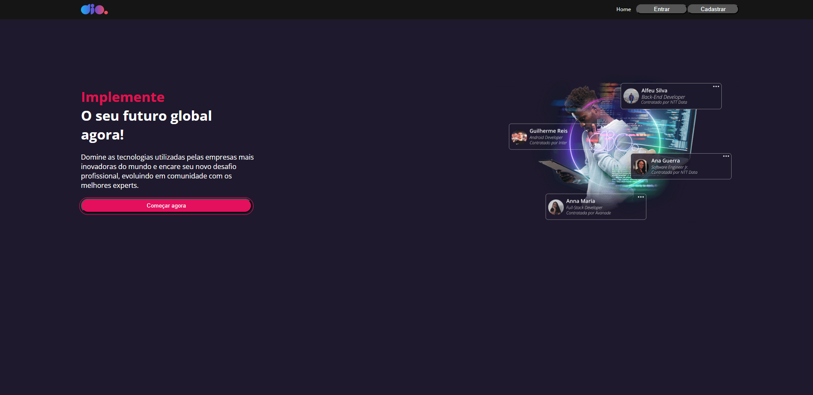
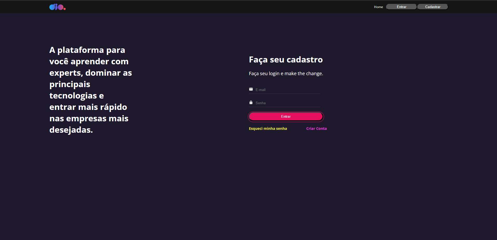
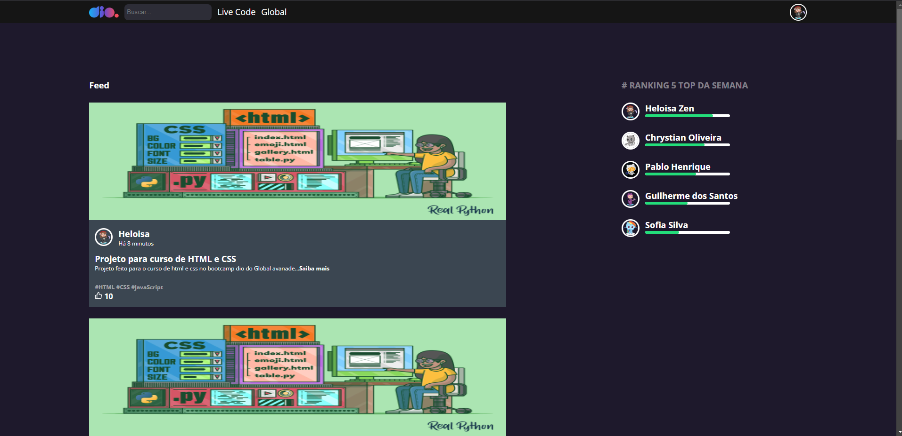

# Clone site DIO

## Descrição do projeto:
Um Projeto do curso "XP Inc. - Full Stack Developer" da DIO, que teve o objetivo de reproduzir as páginas de Home, Login e Feed do site da DIO.

### Tecnologias utilizadas:

 

### Extensões utilizadas:

- ``styled-components``

## Resultados

---

